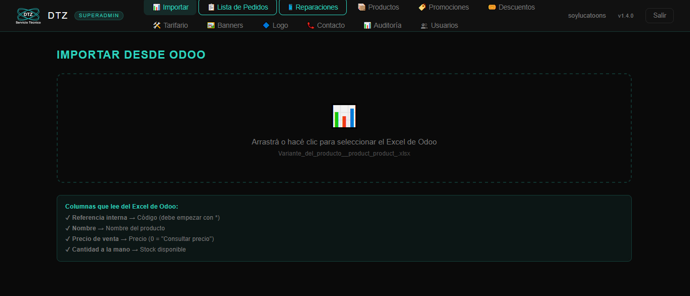
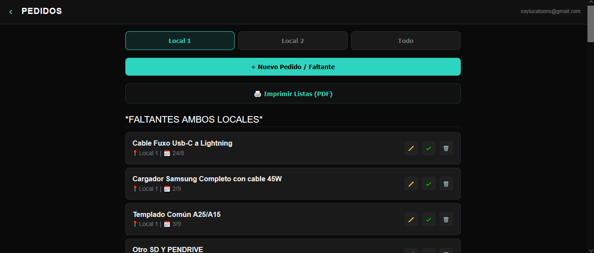
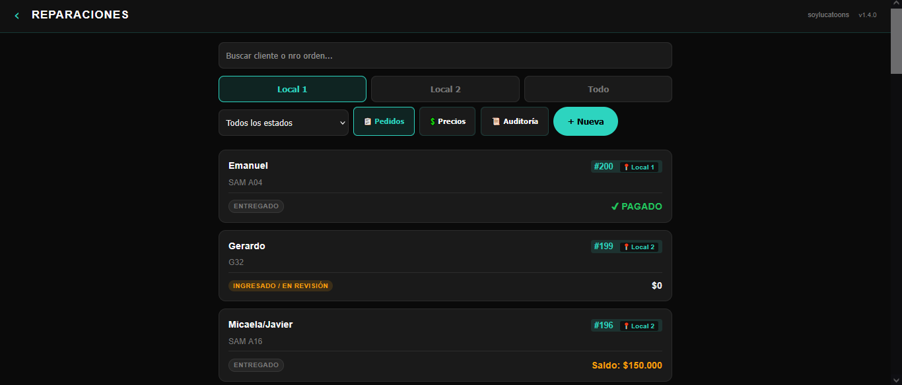
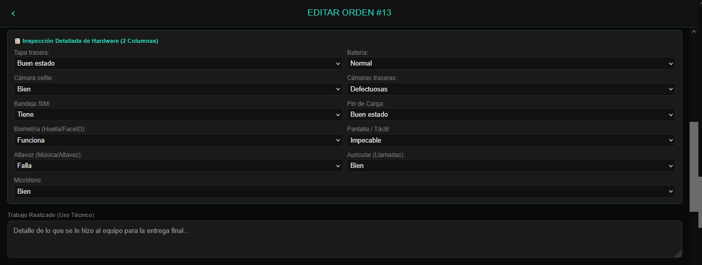
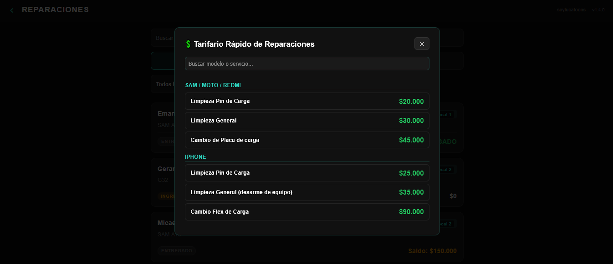
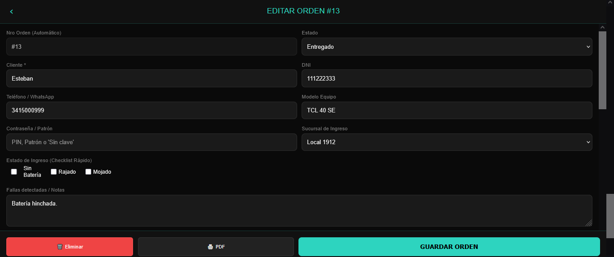

# 📱 DTZ Servicio Técnico — E-Commerce, ERP & PWA Móvil

¡Bienvenido al repositorio oficial del ecosistema informático de **DTZ Servicio Técnico**!  
🌐 **Sitio en vivo:** [www.dtzserviciotecnico.com.ar](https://www.dtzserviciotecnico.com.ar)

Este proyecto nace de la necesidad de proveer a una empresa de servicio técnico informático un **sistema de gestión integral (ERP), un catálogo B2C/B2B y una aplicación móvil para los técnicos**, sin depender de plataformas enlatadas con altas comisiones o costos fijos mensuales.

## 🏗️ Arquitectura y Stack Tecnológico

El proyecto está diseñado bajo un enfoque **Serverless + Backend-First** para maximizar el rendimiento, reducir los tiempos de carga a cero y minimizar los costos operativos.

*   **Frontend Web:** HTML5, CSS3, y Vanilla JavaScript (Cero dependencias pesadas, arquitectura SPA ligera para máxima velocidad FCP).
*   **App Móvil (PWA/Android):** React Native y Expo Web. Compilación multiplataforma con soporte de **Progressive Web App nativa para iOS** y `.apk` para Android.
*   **Backend & Base de Datos:** [Supabase](https://supabase.com/) (PostgreSQL).
*   **Seguridad y Autenticación:** Supabase Auth (JWT) y políticas estrictas **RLS (Row Level Security)**. El control de permisos de lectura/escritura reside exclusivamente en el motor de la base de datos.
*   **Hosting:** GitHub Pages con dominio propio delegado vía Cloudflare DNS.
*   **AI Pair Programming:** Desarrollado íntegramente de cero con asistencia de **Antigravity**, **Claude 3.5 Sonnet / 4.6** y **Gemini 1.5 Pro / 3.1 Pro**.

## 🚀 Funcionalidades Principales

### 🛒 Interfaz de Usuario (Capa Pública B2C/B2B)
*   **Catálogo en tiempo real:** Lectura de productos desde la base de datos con paginación asíncrona.
*   **Carrito Efímero & Promociones:** Motor de cálculo automático de promociones escalonadas y validación segura de **Cupones de Descuento** mediante funciones RPC (Remote Procedure Calls) de PostgreSQL para evitar exposición de la tabla al frontend.
*   **Checkout a WhatsApp:** Generación automática de comprobantes de pedido.

### 🛠️ Módulo de Reparaciones y App Móvil (El Taller)
*   **DTZ Mobile (App de Técnicos):** Una aplicación React Native/Expo que permite a los técnicos escanear y cargar reparaciones.
*   **Firma Digital Cross-Platform:** Captura de firma de conformidad del cliente en el vidrio del celular (implementación condicional entre WebView Canvas para Android y DOM Canvas para Web/iOS).
*   **Generación de PDFs:** Los remitos de reparación se autogeneran en la web incrustando en Base64 la firma digital capturada por la App móvil, listos para imprimir en formato A4 (una sola carilla) o enviar por WhatsApp.
*   **Checklist de Hardware Exhaustivo:** Inspección en tiempo real de 11 componentes críticos (Biometría, Display, Cámaras, etc.) guardados estructuradamente en campos `JSONB`.

### 🛡️ Panel de Administración (El cerebro del sistema)
*   **Importación Masiva Odoo:** Módulo para leer y sincronizar listas de precios desde archivos `.xlsx` nativos de Odoo (ERP secundario).
*   **Control de Roles (RBAC):** Gestión granular de permisos (`superadmin`, `admin`, `staff`).
*   **Registro de Auditoría (Audit Log):** Trazabilidad inmutable implementada desde el backend para monitorear todas las acciones de los empleados.
*   **Integración ImgBB API:** Sistema propio de carga, compresión inteligente local (WebP/JPEG dinámico) y alojamiento de imágenes ilimitado evadiendo cuotas de almacenamiento on-premise.

## 📸 Galería del Sistema (Demo)

Para proteger la privacidad de los clientes de DTZ, adjunto capturas de pantalla del sistema interno utilizando datos de prueba:

<div align="center">
  
  
</div>
<br>
<div align="center">
  
  
</div>
<br>
<div align="center">
  
  
</div>

## 📂 Estructura del Repositorio

A los reclutadores y desarrolladores: Los invito a revisar la carpeta `/docs`, donde documento mi proceso de ingeniería de software, arquitectura de base de datos y auditorías de ciberseguridad.

```text
├── admin.html               # SPA del Panel de Administración ERP
├── index.html               # SPA Pública (Catálogo E-Commerce)
├── /app/                    # App Móvil PWA (Exportación estática de Expo Web)
├── /DTZMobile/              # Código fuente React Native de la App Móvil
├── /db/                     # DDL, Funciones, Triggers y Políticas RLS de Supabase
├── /docs/                   # 🧠 Documentación de diseño arquitectónico y Roadmap
└── backup_dtz.js            # Script Node.js REST API para automatización de respaldos
```

## 🔒 Nota sobre Ciberseguridad
El sistema aprobó una exhaustiva auditoría de seguridad. Dado que el Frontend expone la `anon_key` (estándar en arquitecturas BaaS), **la base de datos se encuentra blindada a nivel SQL**. 
Las reglas de RLS impiden la creación arbitraria de usuarios, el acceso a datos sensibles (teléfonos/pines de clientes) y evitan ataques de escalada de privilegios, validando en cada transacción de PostgreSQL el token JWT y la jerarquía del perfil. Todo el código de seguridad se puede verificar en `db/16_auditoria_seguridad.sql`.

---
*Diseñado, desarrollado y documentado integralmente por [Lucas Miranda U](https://github.com/LucasMirandaU) en colaboración con DTZ Servicio Técnico.*
